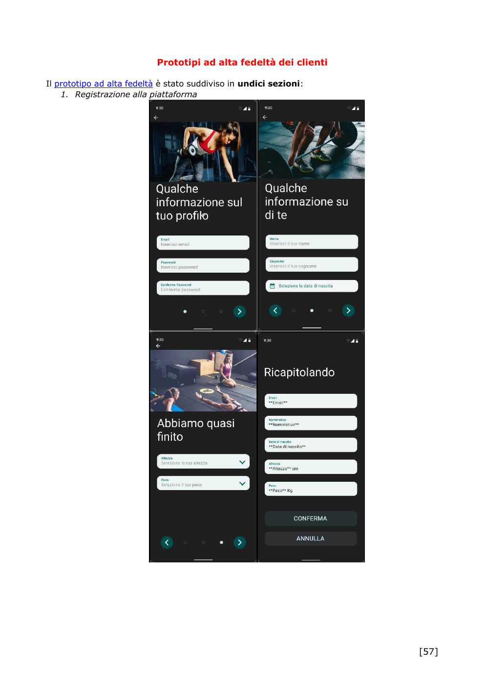
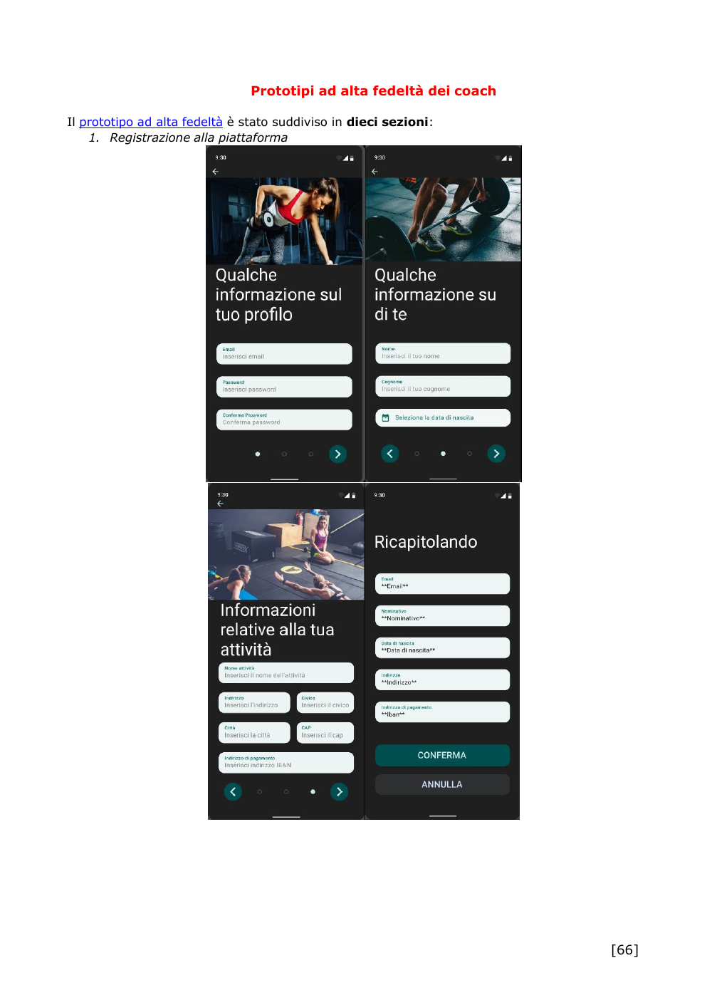
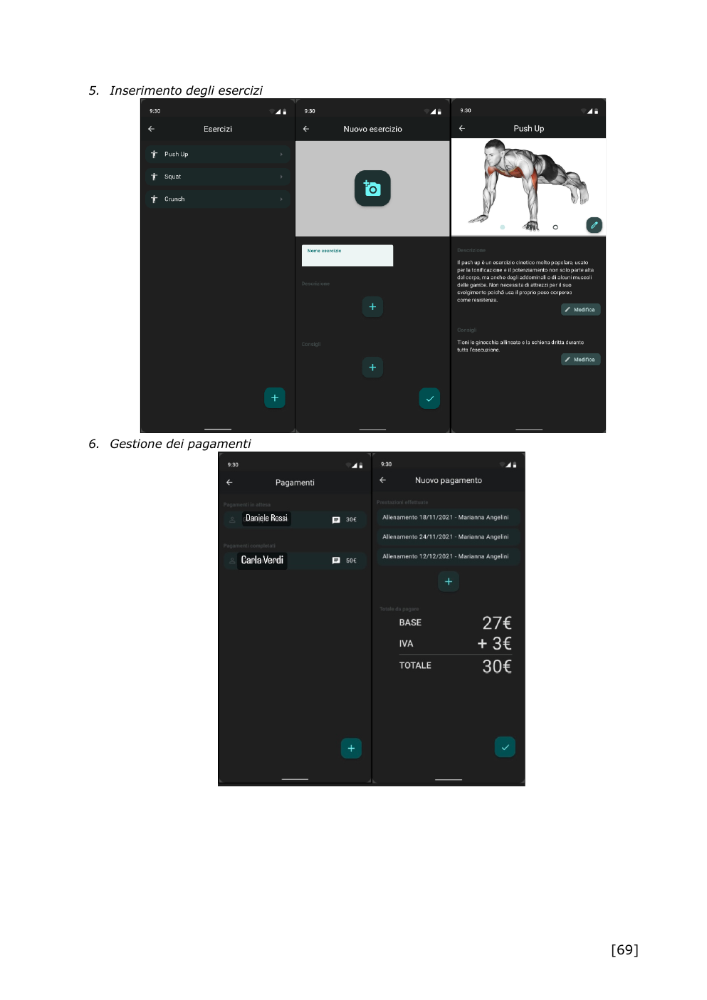
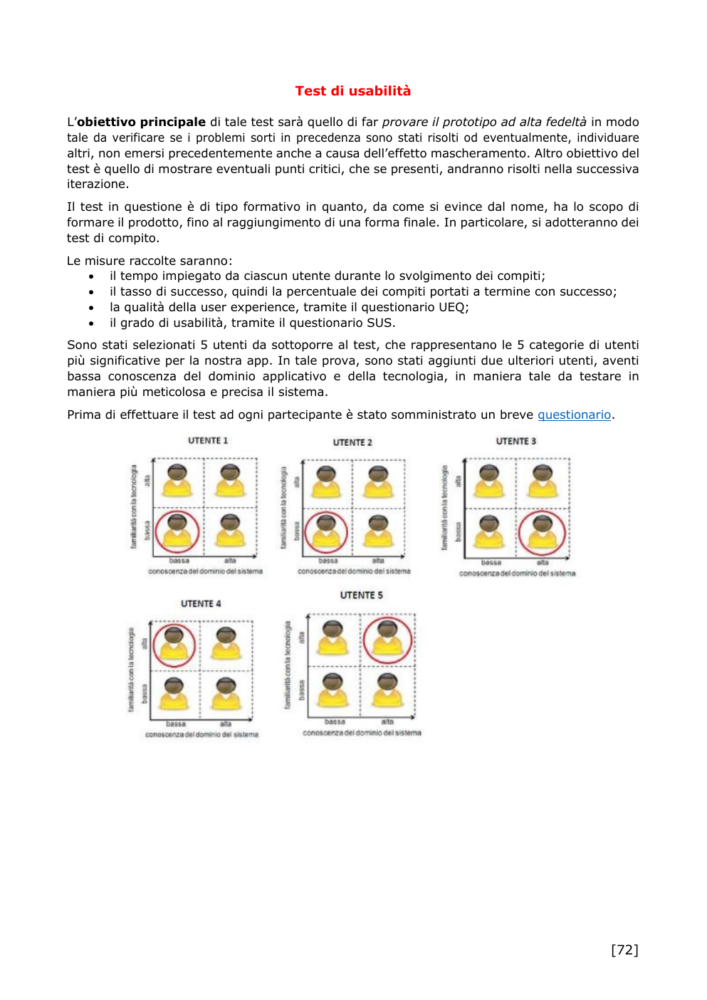

<div align="center">

# NewAge Fitness

### Progetto universitario - Esame di **Progettazione dell'Interazione con l'Utente**

**Corso di Laurea in Informatica e Tecnologie per la Produzione del Software**  
Universita degli Studi di Bari Aldo Moro


</div>

---

## 📌 Descrizione

**NewAge Fitness** e un progetto di UX/UI design dedicato alla progettazione di un'applicazione fitness rivolta a **coach e clienti**.

L'idea nasce con l'obiettivo di semplificare il rapporto tra personal trainer e persone che si allenano, offrendo un unico ambiente per la prenotazione delle sessioni, la consultazione delle schede di allenamento e la comunicazione tra coach e cliente.

Il concept comprende inoltre un **allenatore virtuale**, il monitoraggio dei parametri vitali tramite dispositivi intelligenti e un sistema di premi legato al raggiungimento degli obiettivi.

> Il progetto documenta il processo di **progettazione dell'interazione e prototipazione**. Non contiene un'applicazione software implementata e pronta all'esecuzione.

---

## 🎓 Contesto accademico

**Esame:** Progettazione dell'Interazione con l'Utente  
**Corso di Laurea:** Informatica e Tecnologie per la Produzione del Software  
**Universita:** Universita degli Studi di Bari Aldo Moro

### Team - GMNS Group

- **Sonia Auciello**
- Luigi Dicataldo
- Mario Eligio Bruno
- Nicola Di Leva

---

## 🎯 Obiettivi del progetto

Il progetto e stato sviluppato per studiare e progettare un'esperienza utente che permettesse di:

- mettere in contatto coach e clienti;
- prenotare sessioni di allenamento;
- gestire e consultare le schede di allenamento;
- fornire contenuti multimediali per l'esecuzione degli esercizi;
- supportare il cliente con un coach virtuale;
- monitorare i parametri vitali tramite dispositivi intelligenti;
- gestire pagamenti e prenotazioni lato coach;
- incentivare l'allenamento tramite premi, coupon e obiettivi.

---

## 🔎 Processo di progettazione UX

Il lavoro ha seguito un processo completo di progettazione centrata sull'utente.

### 1. Analisi della concorrenza

Sono state analizzate applicazioni fitness gia esistenti, tra cui:

- App - Palestre
- Seven: 7 minuti di esercizi
- Fiit: Workouts & Fitness Plans

Per ogni prodotto sono stati individuati punti di forza, limiti e opportunita progettuali.

### 2. Analisi dell'utenza potenziale

Sono stati raccolti dati distinguendo due categorie principali:

- **clienti**;
- **coach / personal trainer**.

Le tecniche utilizzate comprendono:

- questionari;
- interviste;
- analisi delle esigenze;
- sintesi dei risultati.

### 3. Personas

A partire dai dati raccolti sono state definite personas rappresentative sia per i clienti sia per i coach.

### 4. Analisi del contesto

Il contesto d'uso e stato analizzato considerando:

- **Who** - chi utilizza il sistema;
- **Where** - dove viene utilizzato;
- **When** - in quali situazioni;
- **Why** - obiettivi e motivazioni degli utenti.

### 5. Requisiti, task e scenari d'uso

Il progetto include:

- analisi dei requisiti;
- analisi dei task;
- scenari d'uso;
- flussi distinti per cliente e coach.

### 6. Prototipi a bassa fedelta

Sono stati progettati prototipi iniziali per verificare struttura, navigazione e comprensibilita dell'interfaccia prima di procedere al raffinamento grafico.

### 7. Test formativi

I prototipi a bassa fedelta sono stati sottoposti a test con utenti rappresentativi. Al termine dei test e stato utilizzato il questionario **QUIS** per raccogliere una valutazione qualitativa dell'interfaccia.

### 8. Prototipi ad alta fedelta

Sulla base dei risultati dei test formativi sono stati realizzati prototipi piu dettagliati per:

- cliente;
- coach.

I prototipi interattivi sono stati realizzati e condivisi tramite **Marvel App**.

### 9. Test di usabilita

La versione ad alta fedelta e stata sottoposta a una seconda fase di valutazione attraverso:

- **SUS - System Usability Scale**;
- **UEQ - User Experience Questionnaire**.

Il rapporto finale evidenzia una buona esperienza utente complessiva e individua ulteriori interventi di miglioramento prima di un'eventuale fase di implementazione.

---

## 🖼️ Estratti del progetto

### Prototipo ad alta fedelta - Cliente



### Prototipo ad alta fedelta - Coach



### Gestione esercizi e pagamenti



### Test di usabilita



---

## 🧪 Metodi di valutazione utilizzati

| Metodo | Fase | Obiettivo |
|---|---|---|
| Questionari | Ricerca iniziale | Comprendere abitudini e bisogni degli utenti |
| Interviste | Ricerca iniziale | Approfondire motivazioni e problemi |
| QUIS | Prototipi a bassa fedelta | Valutazione qualitativa dell'interfaccia |
| SUS | Prototipi ad alta fedelta | Misurare l'usabilita percepita |
| UEQ | Prototipi ad alta fedelta | Valutare la qualita dell'esperienza utente |

---

## 🔗 Prototipi interattivi

I collegamenti ai prototipi Marvel sono raccolti nel file:

➡️ [`PROTOTIPI.md`](PROTOTIPI.md)

---

## 📚 Documentazione

Il repository contiene il materiale principale prodotto per l'esame:

- [`Documentazione completa`](docs/Documentazione_NewAge_Fitness.pdf)
- [`Presentazione`](docs/Presentazione_NewAge_Fitness.pdf)
- [`Screenshot selezionati`](docs/screenshots/)

Le copie pubbliche dei PDF sono state ripulite da indirizzi e-mail universitari e numeri di matricola dei componenti del gruppo.

---

## 📁 Struttura del repository

```text
NewAge-Fitness/
├── README.md
├── PROTOTIPI.md
└── docs/
    ├── Documentazione_NewAge_Fitness.pdf
    ├── Presentazione_NewAge_Fitness.pdf
    └── screenshots/
        ├── prototipo_cliente.png
        ├── comunicazione_coach.png
        ├── prototipo_coach.png
        ├── esercizi_pagamenti.png
        ├── test_usabilita.png
        └── rapporto_finale.png
```

---

## ℹ️ Note

Questo repository raccoglie un **progetto universitario di gruppo** e viene pubblicato a scopo di portfolio accademico.

Il materiale mostra principalmente il processo di ricerca, analisi, progettazione, prototipazione e valutazione dell'usabilita di NewAge Fitness.
